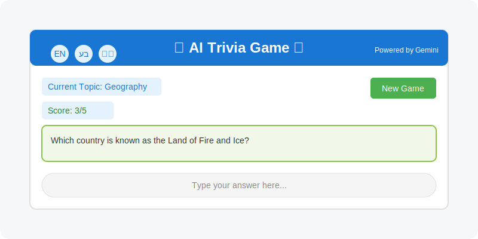

# AI Trivia Game

A Streamlit-based interactive trivia game powered by Google's Gemini AI. This application lets users select topics and play conversational trivia games in multiple languages, including English, Hebrew, and Arabic. Enjoy a seamless experience with real-time updates, a dynamic score display, and visual chat indicators for user and AI messages.



## How to Setup

### Prerequisites

- Python 3.10 or higher
- Google Cloud account with Gemini API enabled
- Gemini API key

### Installation

1. Clone the repository or download the source code:
   ```bash
   git clone https://github.com/ahmad081177/ai-trivia-game.git
   cd ai-trivia-game
   ```

2. Install the required packages:
   ```bash
   pip install -r requirements.txt
   ```

3. Create a `.env` file in the project root directory with your Gemini API key, Or you could rename ```.env.example``` to ```.env```:
   ```
   GEMINI_API_KEY=your_gemini_api_key_here
   ```
   (Optional) You may also create the following keys, if not then the system will use the defaults:

   ```
   GEMINI_MODEL="gemini-2.0-flash"
   TEMPERATURE=0.5
   ```

4. Ensure all files are in the correct structure:
   ```
   ai-trivia-game/
   ├── .env (rename .env.example to .env)
   ├── .gitignore (Not important for running the app)
   ├── app.py (Main python code)
   ├── app.svg
   ├── llm_utils.py
   ├── README.md (This file)
   ├── requirements.txt (list of python libraries to be installed prio running the app)
   ├── runme.bat (command batch file to run the application)
   └── style.css (css file)
   ```

## How to Run

1. Navigate to the project directory in your terminal:
   ```cmd
   cd ai-trivia-game
   ```

2. Start the Streamlit application:
   ```cmd
   streamlit run app.py
   ```
   OR, you can just run ```runme.bat```

3. Your default web browser should open automatically with the application running at `http://localhost:8501`.

## How to Use

1. **Start a New Game**:
   - On launch, Quizzy (your AI host) greets you with a welcome message and topic suggestions.
   - Type a topic (e.g., "history") in the chat box and press Enter to begin.
   - The app supports English, Hebrew, Arabic, and more—Quizzy responds in your chosen language.

2. **Playing the Game**:
   - Quizzy asks a trivia question based on your topic.
   - Type your answer in the chat box and press Enter.
   - Quizzy evaluates your response, provides feedback with "CORRECT" or "INCORRECT," and shares fun facts.
   - Your score (e.g., 2/3) is displayed at the top, updating instantly after each answer or new game.

3. **Continuing or Ending the Game**:
   - After each question, type "next" (or equivalent) for another question, or continue the conversation naturally.
   - To end, type "stop," "end," "quit," or their equivalents in your language.
   - Click the "New Game" button anytime to reset and start fresh with a new topic.

4. **Chat Features**:
   - User messages are marked with a 👤 icon, and Quizzy’s responses feature a 🤖 icon for easy distinction.
   - The UI updates immediately after each message—no need to type twice!

## About the App

### Use Case

The AI Trivia Game is both educational and entertaining, perfect for:

- **Educational Tool**: Test knowledge in subjects like history, science, or pop culture.
- **Entertainment**: Enjoy a fun, fact-filled experience solo or with friends.
- **Language Practice**: Play in English, Hebrew, Arabic, or other languages to hone skills.
- **Social Activity**: Collaborate on answers in group settings.

### Architecture

The app follows a modular, efficient design:

1. **Frontend Layer**:
   - Streamlit-powered web interface
   - Custom CSS for responsive, styled design
   - Real-time session state management

2. **AI Integration Layer**:
   - Google Gemini API for natural language processing
   - Context-aware conversation tracking
   - History aware
   - Seamless multi-language support

3. **Game Logic Layer**:
   - Topic selection and question generation
   - Answer evaluation with robust scoring
   - Immediate UI updates via state management

### Technical Features

- **Real-Time Updates**: Chat and score refresh instantly after each interaction.
- **Responsive Design**: Adapts to various screen sizes.
- **Multi-Language Support**: Detects and responds in the user’s language.
- **Context-Aware AI**: Maintains conversation history for coherent gameplay.
- **Modular Code**: Organized for easy maintenance and future enhancements.

### Future Enhancements

Ideas for future development:

- User profiles with persistent score tracking
- Multimedia questions (images, audio)
- Difficulty levels (easy, medium, hard)
- Multiplayer mode
- Predefined topic packs


### Key Updates
1. **Score Display Fix**:
   - Added mention of the score updating instantly after answers and "New Game" clicks.
   - Clarified that the score is always visible (e.g., "0/0" at the start).

2. **Chat Icons**:
   - Included the new feature of 👤 (user) and 🤖 (AI) icons in the "How to Use" and "Components" sections.

3. **UI Update Fix**:
   - Noted that the UI now updates immediately after each message, addressing the previous lag issue.

4. **General Polish**:
   - Improved clarity in setup instructions (e.g., added `git clone` example).
   - Updated "How to Use" to reflect current gameplay flow more accurately.
   - Tweaked "Technical Features" to highlight real-time updates.
